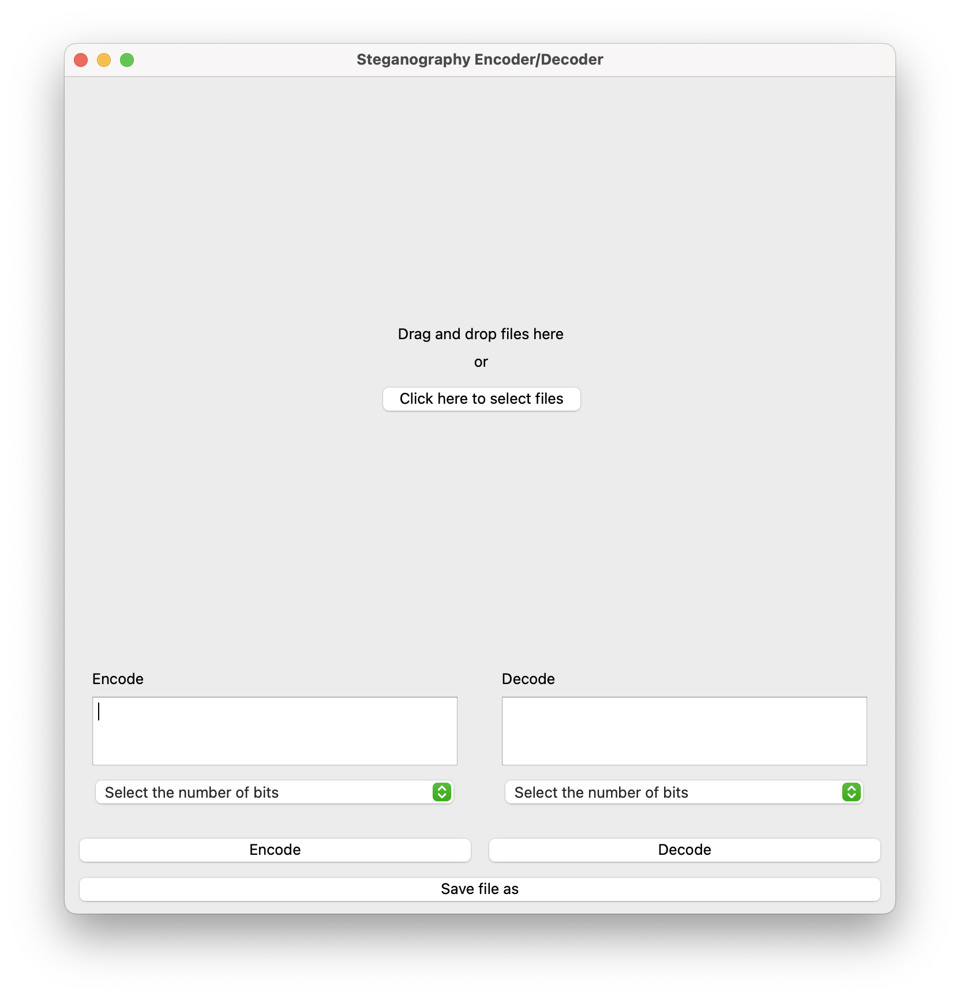
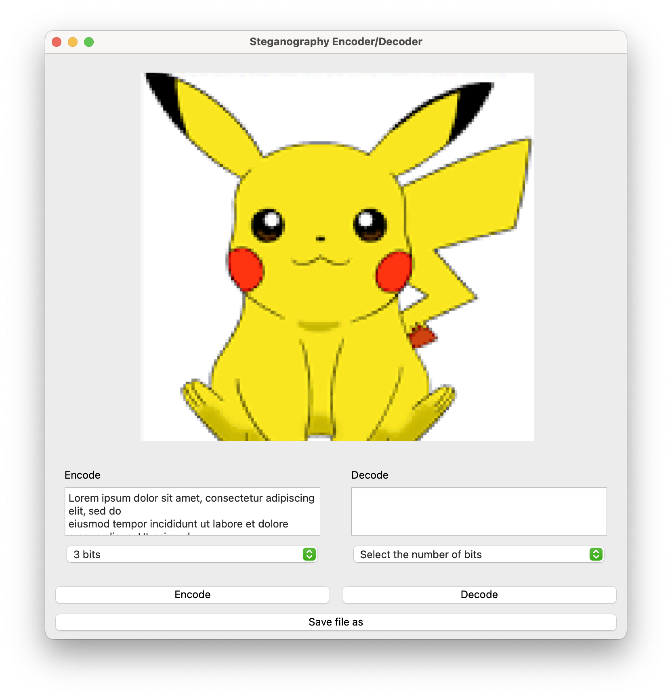
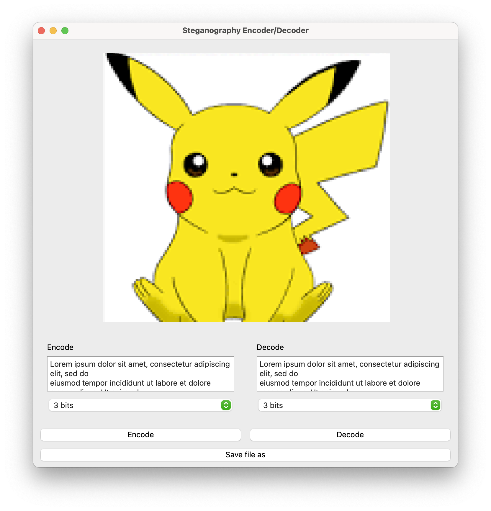

#  Audio, Video, Image and Text Steganography with Python
This is a python application built with PyQt6 that allows users to encode and decode messages in audio, video, image and text files. <br />
##### By [@gabriel-lau](https://www.github.com/gabriel-lau) [@Morenokoko](https://www.github.com/Morenokoko) [@ProneToAdjust](https://www.github.com/ProneToAdjust) [@JoshuaOng](https://www.github.comJoshuaOng) [@vioryllis](https://www.github.com/vioryllis)
###### SIT School project for CSC2005 - Cyber Security Coursework 1
## Installation
For installation of gui components, run:
```
pip install pyqt6
```
For installation of audio video cryptography components, run:
```
pip install wave
```
For installation of image cryptography components, run: <br />
```
pip install pillow
pip install numpy
pip install opencv-python
```

For installation of text cryptography components, run:
```
pip install python-docx
`````
## Supported File Types  
Image | Doccument | Audo/Video
--- | --- | --- 
`.png` `.bmp` `.gif` | `.txt` `.docx` | `.mp3` `.wav` `.mp4`
## Usage
Drag and drop or select the file you want to encode. <br />

Type in the message you want to encode, select the number of least significant bits to encode over and click encode. <br />

Once the encoding is done click decode to see your message and save the file. <br />


## Roles
### [@gabriel-lau](https://www.github.com/gabriel-lau)
- GUI
### [@Morenokoko](https://www.github.com/Morenokoko)
- Code Integration
- gif Steganography
### [@ProneToAdjust]()
- Audio Steganography
- Video Steganography
### [@JoshuaOng](https://www.github.comJoshuaOng)
- Image Steganography
### [@vioryllis](https://www.github.com/vioryllis)
- Text Steganography
- Document Steganography